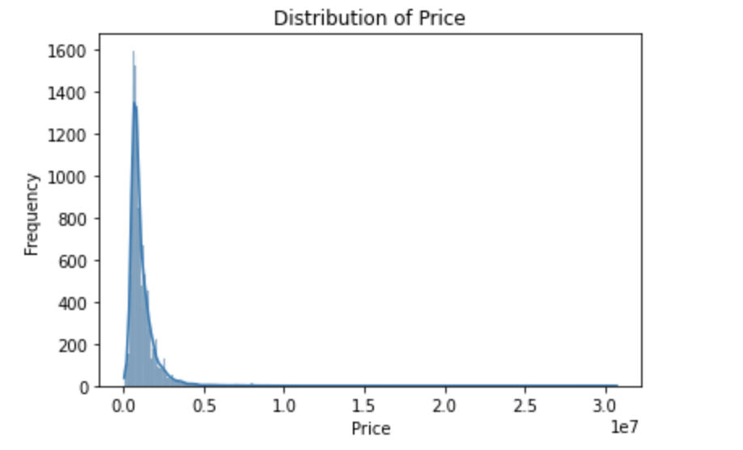
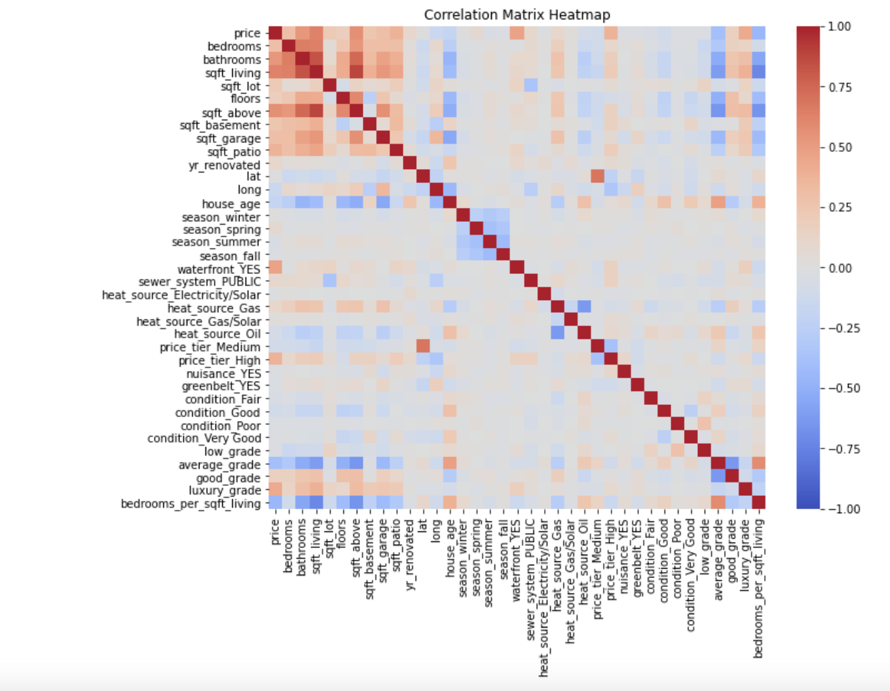
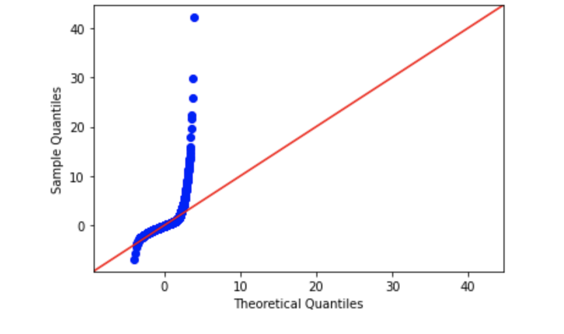
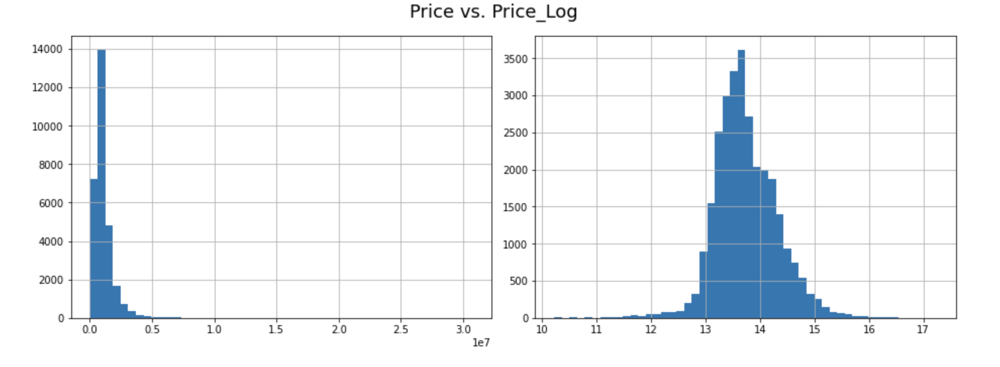
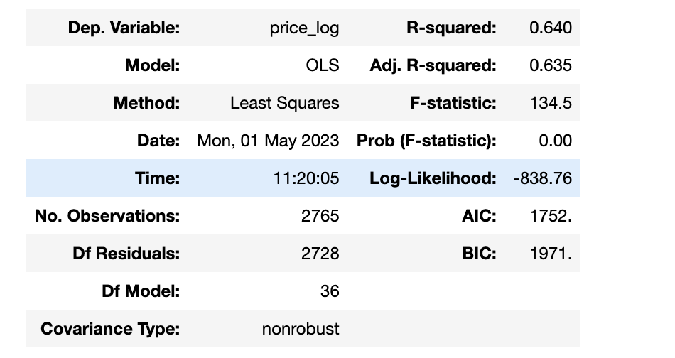
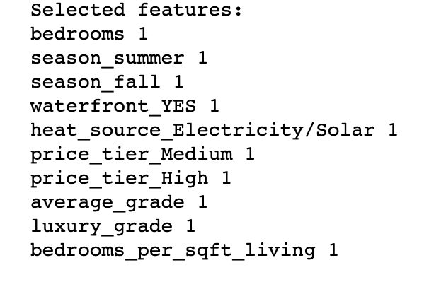
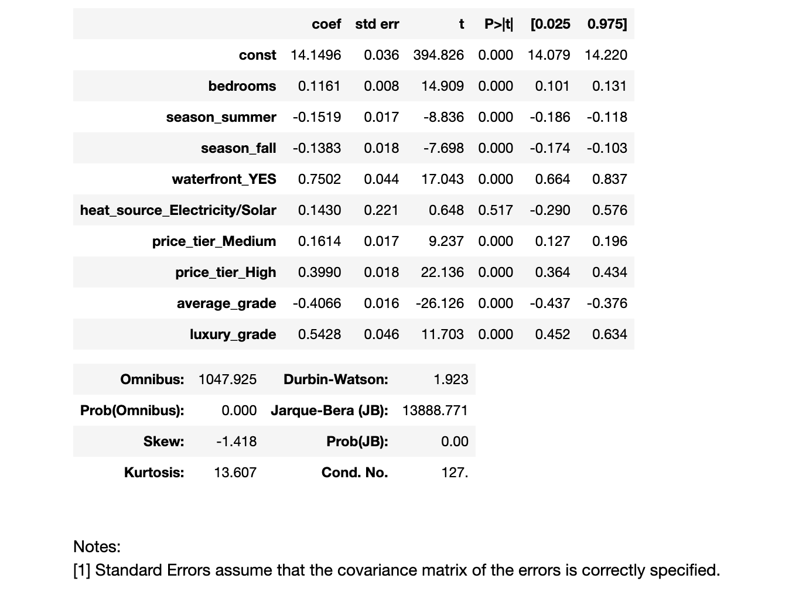
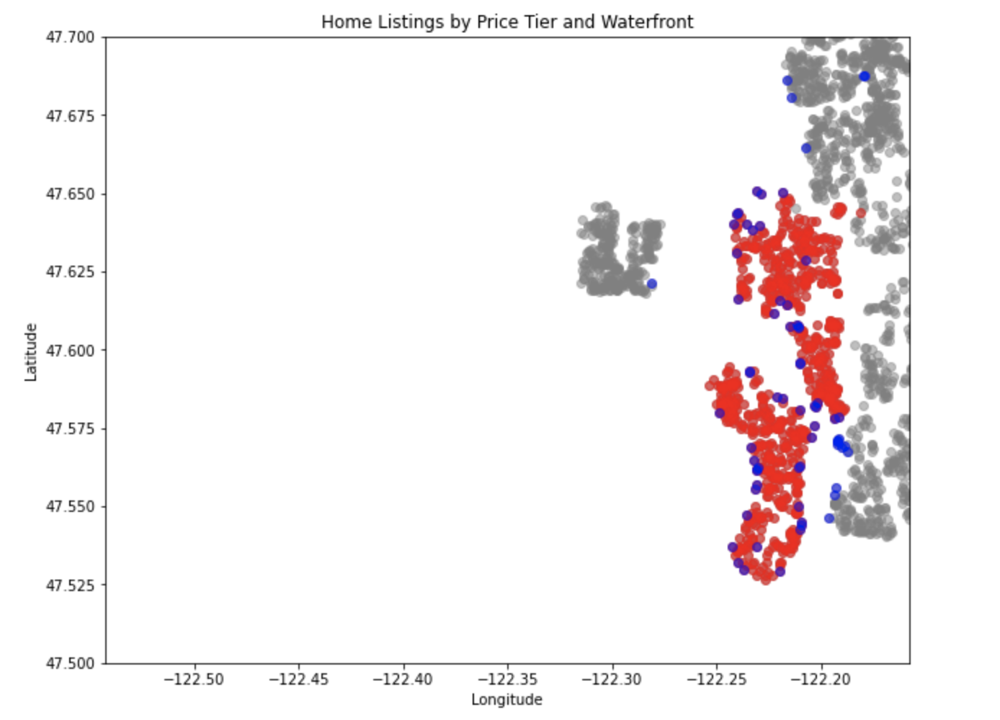

# Phase 2 Project: Multiple Linear Regression 

### Model-informed recommendations for real estate

## Business Understanding

Real estate company Long and Foster has expanded their operations to King County, Washington, and is interested in developing a predictive model that can estimate the sale price of a house. Being new to the area, they are not familiar with the housing landscape and need to better understand their market. By analyzing various factors such as the number of bedrooms, bathrooms, square footage of the house, location, and other important features, L&F aim to provide more accurate home sale price estimates to their clients and improve their business efficiency.

The modeling process will also help Long and Foster identify potential investment opportunities in the county by analyzing which features have the most significant impact on the sale price of a house. By using the results of the analysis, the company can make better decisions regarding their investments in the county.

The objective of this project is to create a multiple linear regression model that can predict the sale price of a house based on predictive factors and provide insights that can help Long and Foster improve their business operations.

## Data Understanding

For this project, we are using 'kc_house_data.csv', a public, tabular dataset lifted from from King County, WA's website (kingcounty.gov).

Our target variable is 'price', which records final sale price of King County homes. Columns serve as features (predictors) in this dataset. The dataset has been updated to include homes sold up until the year 2022.

### Summary of exploratory data analysis

There are 30,155 observations and 25 features in the dataset.

Numeric predictors are: 'id' (recordor observation number), 'date' (date sold), 'bedrooms' (no. bedrooms), 'bathrooms' (no. bathrooms), 'sqft_above'(square footage of home apart from basement), 'sqft_living'(square footage of living space in the home),'sqft_lot'(square footage of lot), 'sqft_garage'(square footage of garage), 'sqft_patio(square footage of outdoor patio),'floors'(number of floors, including levels, in the home), 'yr_built'(year home was built), 'yr_renovated'(if and when home was renovated), 'lat'(latitude coordinate), and 'long'(longitude coordinate).

Categorical predictors are: 'waterfront'(whether or not home is on a waterfront, eg. Puget Sound, Lake Washington, etc.), 'greenbelt'(whether or not home is near or adjacent to a green belt or natural land),'nuisance'(whether or not the home is near an airport, heavy traffic, or other notable nuisances), 'view'(quality of both nature and city views from the home), 'condition'(overall codified condition of the house as defined by (https://info.kingcounty.gov/assessor/esales/Glossary.aspx?type=r), 'grade'(overall grade of the house pertaining to construction and design), 'heat_source'(heat source type), and 'sewer_system'(sewer system type).

There are 32 null values in feature 'heat_source' and 14 in 'sewer_system'.

Target 'price' is fairly skewed.

## Data Preparation

### Feature Engineering & Encoding

We created new features and one-hot encoded categorical features to come up with the following set of features:

'id', 'date', 'price', 'bedrooms', 'bathrooms', 'sqft_living',
       'sqft_lot', 'floors', 'view', 'sqft_above', 'sqft_basement',
       'sqft_garage', 'sqft_patio', 'yr_built', 'yr_renovated', 'address',
       'lat', 'long', 'house_age', 'month', 'year', 'day', 'season_winter',
       'season_spring', 'season_summer', 'season_fall', 'state', 'zip', 'city',
       'waterfront_YES', 'sewer_system_PUBLIC',
       'heat_source_Electricity/Solar', 'heat_source_Gas',
       'heat_source_Gas/Solar', 'heat_source_Oil', 'price_tier_Medium',
       'price_tier_High', 'nuisance_YES', 'greenbelt_YES', 'condition_Fair',
       'condition_Good', 'condition_Poor', 'condition_Very Good',
       'grade_11 Excellent', 'grade_12 Luxury', 'grade_13 Mansion',
       'grade_4 Low', 'grade_5 Fair', 'grade_6 Low Average', 'grade_7 Average',
       'grade_8 Good', 'grade_9 Better'
       

### Identifying correlated features 

##### Heatmap of correlated variables

### Baseline model results:

Using the raw data from target 'price' and selected feature 'sqft_living', we create a simple baseline model.

The model's F-statistic is 1829.4, which indicates that the model is significant and that at least one of the predictor variables is useful for predicting the target variable (price). The low p-value of 3.4796708481783517e-307 indicates that the model is statistically significant and that there is strong evidence that at least one of the predictors is related to the target variable.

The R-squared value of 0.4 indicates that the model explains about 40% of the variance in the target variable. This means that there is still a lot of unexplained variation in the target variable that is not accounted for by the predictor variable (sqft_living).

The regression coefficient for sqft_living is 800.061612, which means that for each additional square foot of living space, the sale price of the home increases by about $800. The constant term of -92223.53 represents the estimated value of the target variable when the predictor variable is zero (i.e., when the living space is zero). However, this interpretation is not meaningful in this case since it is impossible for a home to have zero living space.

The qq plot above shows that a large portion of the true data points in 'sqft_living' stray far from normal distribution. This means that the model is underestimating the price for many of the higher values of 'sqft_living'. This is even further evidence that we will likely omit it from future modeling.

## Iterating the model

### Log Transformations

After performing log transformation on the target and feature from our simple baseline model, we see that the distribution of each normalizes:

### Multiple linear regression: all-features model

### Recursive Feature Elimination

### Iterated all-features model

After using features selected by RFE, the following results came throuhg:

# Final model interpretation

***The R-squared value of 0.513*** indicates that approximately 51% of the variation in the dependent variable can be explained by the independent variables in the model, which is a bit of a decrease from our all-features model R-squared value of 0.640. This isn't bad, but the model could better explain variability in price_log.

The model's diagnostics show that the residuals are not normally distributed, as indicated by the significant Jarque-Bera test result (p-value of 0.00). Additionally, the Durbin-Watson statistic of 1.923 suggests the presence of positive autocorrelation in the residuals, indicating that the model may not be capturing all of the relevant variables.

Using two standout coefficients above, we can calculate the percentage increase in price_log associated with waterfront_YES and price_tier_High as follows:

***For waterfront_YES:***

The coefficient for waterfront_YES is 0.7502. This means that, holding all other variables constant, a property with a waterfront view is associated with a 75.02% increase in price_log compared to a property without a waterfront view. This translates to a (exp(0.7502) - 1) * 100 = 110.87% increase in price.

***For price_tier_High:***

The coefficient for price_tier_High is 0.3990. This means that, holding all other variables constant, a property in the highest price tier is associated with a 39.90% increase in price_log compared to a property in the lowest price tier (the reference category). This translates to a (exp(0.3990) - 1) * 100 = 48.96% increase in price.

### RECOMMENDATIONS

#### High Zipcode Tier, Waterfront properties

As we can see from the plot above, the majority of price_tier_High listing zone contains the majority of waterfront listings.

For Long and Foster to maximize profits as they break into the King County housing market, we recommend concentrating in the price_tier_High zone (zip codes 98039, 98004 & 98040), placing a special focus on waterfront properties, as those properties have the potential to yield highest sale prices.
