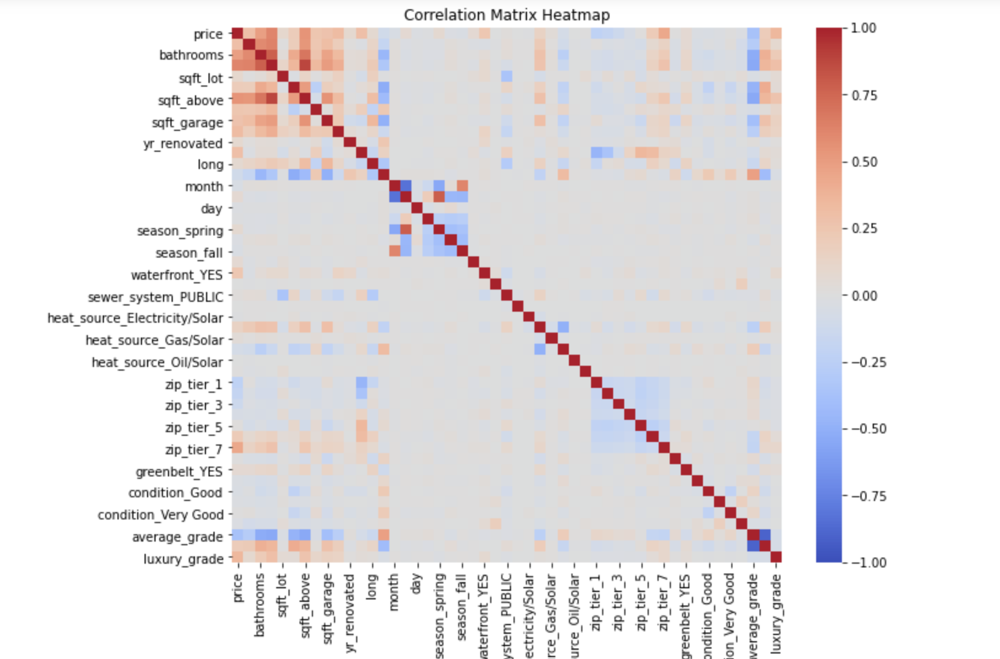
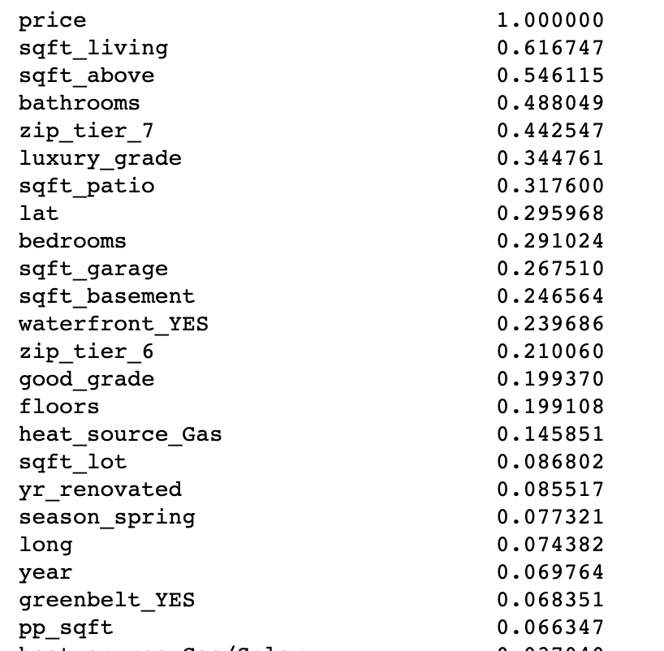
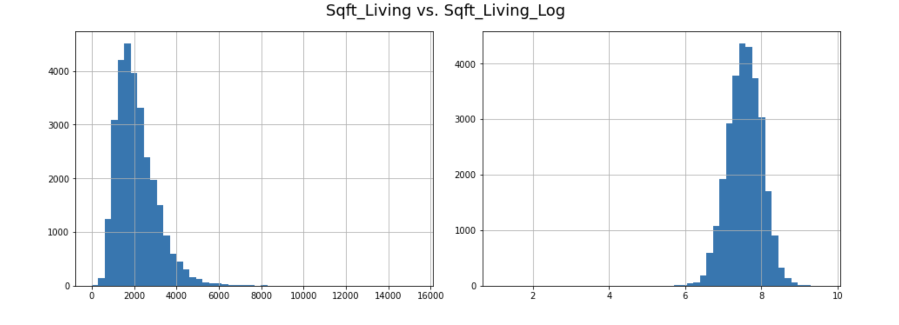
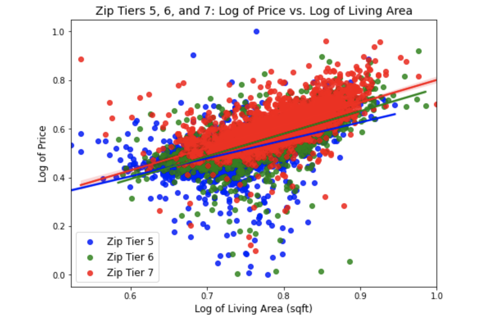

# Phase 2 Project: Multiple Linear Regression 

### Model-informed recommendations for real estate

## Business Understanding

Real estate company Long and Foster has expanded their operations to King County, Washington, and is interested in developing a predictive model that can estimate the sale price of a house. Being new to the area, they are not familiar with the housing landscape and need to better understand their market. By analyzing various factors such as the number of bedrooms, bathrooms, square footage of the house, location, and other important features, L&F aim to provide more accurate home sale price estimates to their clients and improve their business efficiency.

The modeling process will also help Long and Foster identify potential investment opportunities in the county by analyzing which features have the most significant impact on the sale price of a house. By using the results of the analysis, the company can make better decisions regarding their investments in the county.

The objective of this project is to create a multiple linear regression model that can predict the sale price of a house based on predictive factors and provide insights that can help Long and Foster improve their business operations.

## Data Understanding

For this project, we are using 'kc_house_data.csv', a public, tabular dataset lifted from from King County, WA's website (kingcounty.gov).

Our target variable is 'price', which records final sale price of King County homes. Columns serve as features (predictors) in this dataset. The dataset has been updated to include homes sold up until the year 2022.

### Summary of exploratory data analysis

There are 30,155 observations and 25 features in the dataset.

Numeric predictors are: 'id' (recordor observation number), 'date' (date sold), 'bedrooms' (no. bedrooms), 'bathrooms' (no. bathrooms), 'sqft_above'(square footage of home apart from basement), 'sqft_living'(square footage of living space in the home),'sqft_lot'(square footage of lot), 'sqft_garage'(square footage of garage), 'sqft_patio(square footage of outdoor patio),'floors'(number of floors, including levels, in the home), 'yr_built'(year home was built), 'yr_renovated'(if and when home was renovated), 'lat'(latitude coordinate), and 'long'(longitude coordinate).

Categorical predictors are: 'waterfront'(whether or not home is on a waterfront, eg. Puget Sound, Lake Washington, etc.), 'greenbelt'(whether or not home is near or adjacent to a green belt or natural land),'nuisance'(whether or not the home is near an airport, heavy traffic, or other notable nuisances), 'view'(quality of both nature and city views from the home), 'condition'(overall codified condition of the house as defined by (https://info.kingcounty.gov/assessor/esales/Glossary.aspx?type=r), 'grade'(overall grade of the house pertaining to construction and design), 'heat_source'(heat source type), and 'sewer_system'(sewer system type).

There are 32 null values in feature 'heat_source' and 14 in 'sewer_system'.

Target 'price' is fairly skewed.

## Data Preparation

### Feature Engineering & Encoding

We created new features and one-hot encoded categorical features to come up with the following set of features:

[id', 'date', 'price', 'bedrooms', 'bathrooms', 'sqft_living',
       'sqft_lot', 'floors', 'view', 'sqft_above', 'sqft_basement',
       'sqft_garage', 'sqft_patio', 'yr_built', 'yr_renovated', 'address',
       'lat', 'long', 'house_age', 'month', 'year', 'day', 'season_winter',
       'season_spring', 'season_summer', 'season_fall', 'pp_sqft', 'state',
       'zip', 'city', 'waterfront_YES', 'sewer_system_PRIVATE RESTRICTED',
       'sewer_system_PUBLIC', 'sewer_system_PUBLIC RESTRICTED',
       'heat_source_Electricity/Solar', 'heat_source_Gas',
       'heat_source_Gas/Solar', 'heat_source_Oil', 'heat_source_Oil/Solar',
       'heat_source_Other', 'zip_tier_1', 'zip_tier_2', 'zip_tier_3',
       'zip_tier_4', 'zip_tier_5', 'zip_tier_6', 'zip_tier_7', 'nuisance_YES',
       'greenbelt_YES', 'condition_Fair', 'condition_Good', 'condition_Poor',
       'condition_Very Good', 'grade_11 Excellent', 'grade_12 Luxury',
       'grade_13 Mansion', 'grade_2 Substandard', 'grade_3 Poor',
       'grade_4 Low', 'grade_5 Fair', 'grade_6 Low Average', 'grade_7 Average',
       'grade_8 Good', 'grade_9 Better']

### Identifying correlated features 

##### Heatmap of correlated variables

##### Correlation matrix with respect to 'price'

### Baseline model results:

Using the raw data from target 'price' and selected feature 'sqft_living', we create a simple baseline model.

The model's F-statistic is 17926.67, which indicates that the model is significant and that at least one of the predictor variables is useful for predicting the target variable (price). The p-value of 0.0 indicates that the model is statistically significant and that there is strong evidence that at least one of the predictors is related to the target variable.

The R-squared value of 0.3804 indicates that the model explains about 38% of the variance in the target variable. This means that there is still a lot of unexplained variation in the target variable that is not accounted for by the predictor variable (sqft_living).

The regression coefficient for sqft_living is 565.41, which means that for each additional square foot of living space, the sale price of the home increases by $565.41. The constant term of -92223.53 represents the estimated value of the target variable when the predictor variable is zero (i.e., when the living space is zero). However, this interpretation is not meaningful in this case since it is impossible for a home to have zero living space.

The qq plot above shows that a large portion of the true data points in 'sqft_living' stray far from normal distribution. This means that the model is underestimating the price for many of the higher values of 'sqft_living'. This is even further evidence that we should log-transform.

## Iterating the model

### Log Transformations

After performing log transformation on the target and feature from our simple baseline model, we see that the distribution of each normalizes:

### Scaling

Using MinMaxScaler from Sci-kit Learn, we were able to scale the data to a given range (0 - 1).

This is done by subtracting the minimum value of the feature and then dividing it by the range (the difference between the maximum and minimum values). The purpose of feature scaling is to standardize the range of independent variables or features of data. 

### Multiple linear regression: all-features model

In our first iteration of the baseline model we decided to use all relevant features, excluding features that had either been used to create new features or had been dropped altogether( like 'address', 'city', 'state', 'date' and 'id'). 

Using all relevant features, our r-squared value jumped to 0.697, which tells us that the model can help explain around 70% of the variation in new target 'price_log'. 

Based on the all-features model, which contained high amounts of collinearity, we concluded that certain features (according to their coefficients and corresponding p-values), should be dropped. The  features affecting our model were: 'bedrooms', 'season_winter', 'sewer_system_PUBLIC RESTRICTED', 'heat_source_Oil', 'heat_source_Oil/Solar', 'greenbelt_YES', 'luxury_grade', 'sqft_garage_log', and 'heat_source_Other'. 

### Iterated all-features model

After dropping offending features, we came out with a similar r-sq value as our previous model, but multicollinearity had been addressed, and we reached certain conclusions about the groups of features that had the most impact on predicting prices: 'sqft' features and 'zip_tier' features.

Based on their coefficients, the 7 most significant features and their corresponding coefficients in our final model are:

- pp_sqft: 0.632
- sqft_above: 0.302
- sqft_living_log: 0.216
- zip_tier_7: 0.125
- zip_tier_6: 0.092
- sqft_basement: 0.077
- zip_tier_5: 0.075

Predicted percentage increase in price_log for pp_sqft: 88.14%
Predicted percentage percentage increase in price_log for sqft_above: 35.26%
Predicted percentage percentage increase in price_log for sqft_living_log: 24.11%
Predicted percentage increase in price_log for zip_tier_7: 13.31%
Predicted percentage increase in price_log for zip_tier_6: 9.64%
Predicted percentage increase in price_log for sqft_basement: 8.00%
Predicted percentage increase in price_log for zip_tier_5: 7.79%

In this plot, we're showing the interaction between sqft_living_log and our top 3 zipcode tiers (5, 6, &7). Between tiers 5 and 7, the datapoints fit progressively closer to the fitted regression lines. It looks like we could have spent some more time checking for outliers in the data to avoid homoscedasicity. However, the relationships appear fairly linear and provide us with the notion that with every increase in zip tier, sqft of living area increases, and consequently, so does home sale price.

# Modeling conclusions and next steps

#### LOCATION IS KEY

Recall that Zip Tear 7 consists of these zipcodes: 98055, 98133, 98178, 98118, 98027, 98166, 98030, 98023, 98019, 98144, 98031, 98092, 98103, 98006, 98136, 98007, 98038, 98057, 98077, 98126, 98053, 98039, 98107, 98008, 98155, 98168, 98199, 98004, 98045, 98052, 98011, 98033, 98116, 98198, 98125, 98112, 98034, 98056, 98059, 98005, 98040, 98014, 98106, 98029, 98122, 98117, 98042, 98119, 98065, 98022, 98072, 98058, 98108, 98115, 98074, 98105, 98024, 98146, 98109, 98102, 98028, 98188, 98177, 98075, 98010, 98148, 98047, 98032, 98070, 98051, 98050, 98251, 98223, 98224, 98270.

This information can be used by Long and Foster to identify which areas have the highest demand for homes and which areas are likely to see the greatest appreciation in value over time. By focusing their marketing efforts and investing in properties in these zip codes, they can maximize their profits and provide their clients with the best possible returns on their investments.

Additionally, the zip tier features can also provide valuable insights into the amenities and features of each location. For example, properties in zip_tier_6 and zip_tier_7 are likely to be closer to urban centers and have access to a wider range of amenities, such as restaurants, shopping centers, and public transportation. Properties in zip_tier_5, on the other hand, may be more suburban or rural and offer more space and privacy.

Overall, the zip tier features and their coefficients provide a wealth of information for real estate companies like Long and Foster. By understanding the impact of location on the price of a house, they can make informed decisions about where to invest their resources and how to market their properties to potential buyers.
